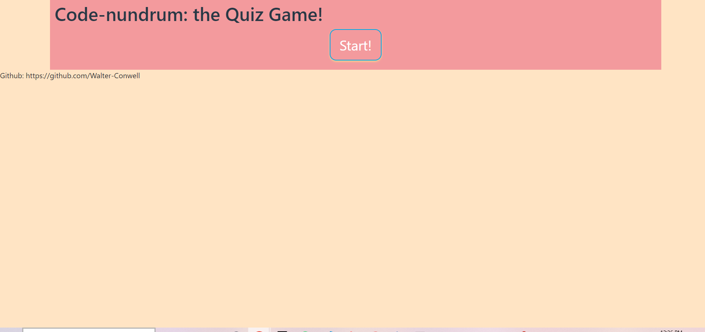
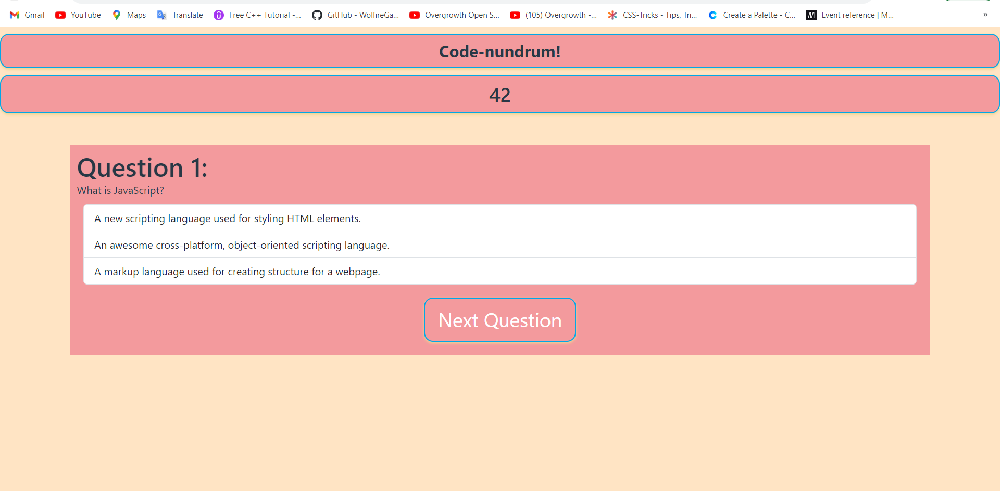
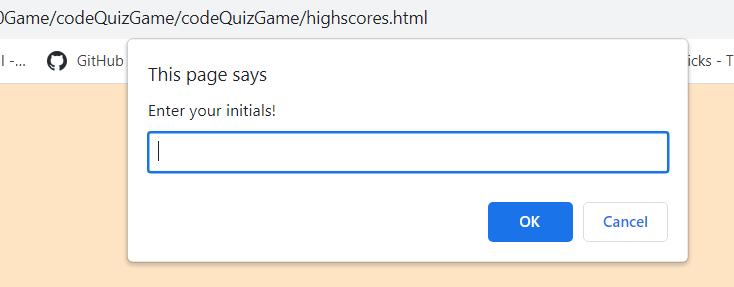
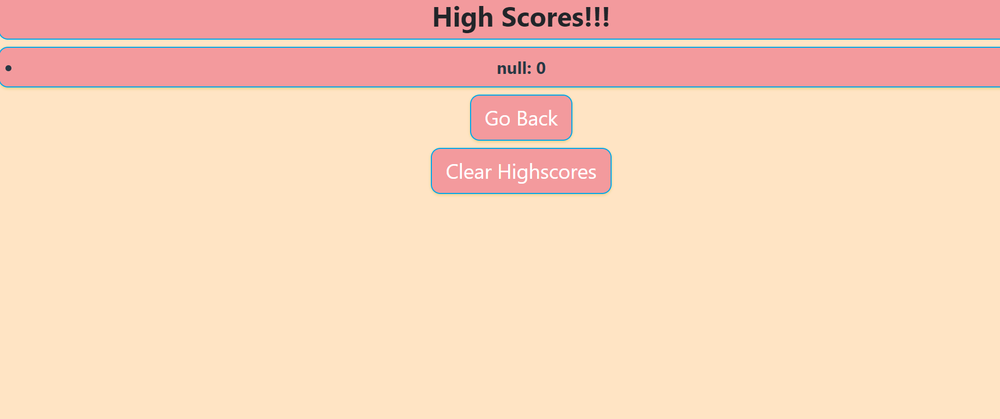

# Web APIs: Code Quiz

- Practice for a technical interview with some multiple-choice coding questions! Race against the 60 second timer and answer all of the questions. But beware, pressing the wrong answer will subtract 5 seconds off of the timer. At the end of the questions, the player is notified that their time is up, and then brought to a page to input their initials. Their score is then kept in local storage and displayed alongside their intials.

## Screenshots

- 

- 

- 

- 

### Deployment:

- repo link: https://github.com/Walter-Conwell/codeQuizGame

- Live deployment link:

### Sources

- I recieved help in tutoring from Jacob Carver to create the timer functionality.
- I also used web mdn docs for help with the window attribute: https://developer.mozilla.org/en-US/docs/Web/API/Window/window
